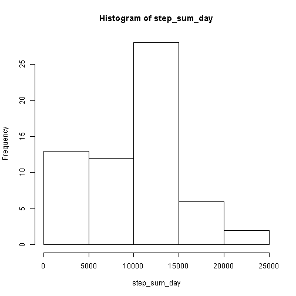
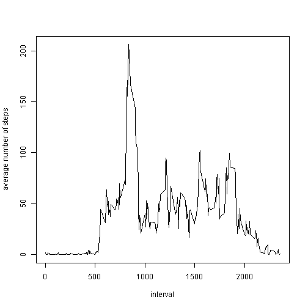
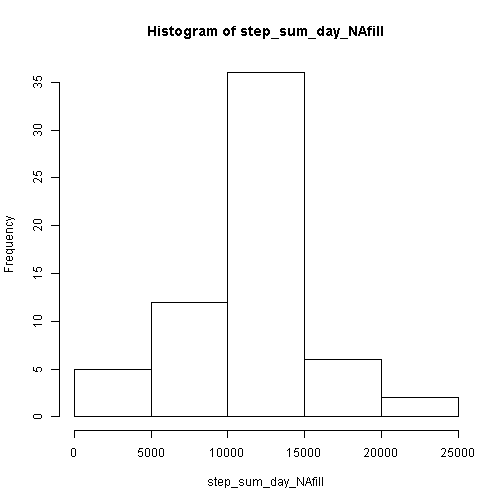
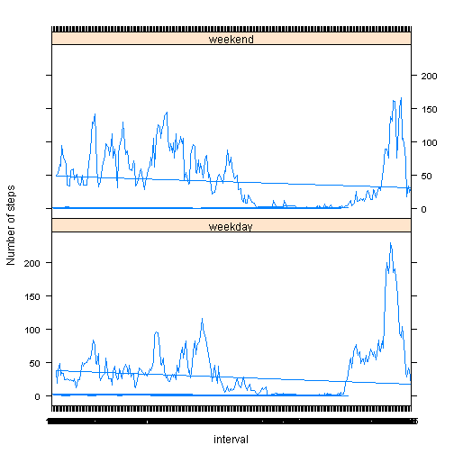

========================================================
Loading and preprocessing the data

```r
#Download the data and unzip
download.file("http://d396qusza40orc.cloudfront.net/repdata%2Fdata%2Factivity.zip",destfile="PA1.zip")
unzip("PA1.zip")
#Load the data
activity_data <- read.csv("activity.csv")
```

The mean total number of steps taken per day.

```r
#calculate the total number of steps by day interval
step_sum_day <- tapply(activity_data$steps,activity_data$date,sum,na.rm=TRUE)
# do the histogram
hist(step_sum_day)
```

 

```r
#calculate the mean of steps by day 
step_mean_day <- tapply(activity_data$steps,activity_data$date,mean,na.rm=TRUE)
#calculate the median of steps by day
step_median_day <- tapply(activity_data$steps,activity_data$date,median,na.rm=TRUE)
```

The average daily activity pattern.

```r
#calculate the mean of steps by interval
step_mean_interval <- tapply(activity_data$steps,activity_data$interval,mean,na.rm=TRUE)
#plot the line
plot(x=names(step_mean_interval),y=step_mean_interval,type="l",xlab="interval",ylab="average number of steps")
```

 

```r
#to figure out which interval of 5-minute contains the maximum of steps
names(step_mean_interval)[which.max(step_mean_interval)]
```

```
## [1] "835"
```

Imputing missing values.

```r
#Calculate the total number of missing values in the dataset
original_rows_no. <- dim(activity_data)[1]
omitnas_rows_no. <- dim(na.omit(activity_data))[1]
nas_rows_nos <- original_rows_no. - omitnas_rows_no.
#The strategy to taggle the NAs is to replace them with the average number for that 5-minute interval
step_mean_interval_temp<-c()
for(i in 1:(dim(activity_data)[1]/length(step_mean_interval))){
  step_mean_interval_temp<-c(step_mean_interval_temp,step_mean_interval)
}
activity_data$steps[which(is.na(activity_data$steps))]<-step_mean_interval_temp[which(is.na(activity_data$steps))]
#create the new dataset with the missing values filled in
activity_data_NAfill <- activity_data
activity_data <- read.csv("activity.csv")
#Make a histogram of the total number of steps taken each day and Calculate and report the mean and median total number of steps taken per day.
#And compare with the previous ones
#calculate the total number of steps by day interval
step_sum_day_NAfill <- tapply(activity_data_NAfill$steps,activity_data_NAfill$date,sum,na.rm=TRUE)
# do the histogram plot
hist(step_sum_day_NAfill)
```

 

```r
#calculate the mean of steps by day 
step_mean_day_NAfill <- tapply(activity_data_NAfill$steps,activity_data_NAfill$date,mean,na.rm=TRUE)
#calculate the median of steps by day
step_median_day_NAfill <- tapply(activity_data_NAfill$steps,activity_data_NAfill$date,median,na.rm=TRUE)
#Compare the mean between the previous one and the new data set with NA filled
summary(step_mean_day)
```

```
##    Min. 1st Qu.  Median    Mean 3rd Qu.    Max.    NA's 
##  0.1424 30.7000 37.3800 37.3800 46.1600 73.5900       8
```

```r
summary(step_mean_day_NAfill)
```

```
##    Min. 1st Qu.  Median    Mean 3rd Qu.    Max. 
##  0.1424 34.0900 37.3800 37.3800 44.4800 73.5900
```

```r
#Compare the median between the previous one and the new data set with NA filled
summary(step_median_day)
```

```
##    Min. 1st Qu.  Median    Mean 3rd Qu.    Max.    NA's 
##       0       0       0       0       0       0       8
```

```r
summary(step_median_day_NAfill)
```

```
##    Min. 1st Qu.  Median    Mean 3rd Qu.    Max. 
##   0.000   0.000   0.000   4.474   0.000  34.110
```

differences in activity patterns between weekdays and weekends

```r
#Create a new factor variable in the dataset with two levels -- "weekday" and "weekend" indicating whether a given date is a weekday or weekend day.
activity_data_NAfill$date <- as.Date(activity_data_NAfill$date)
weekday_indicator <- weekdays(activity_data_NAfill$date)
for (i in 1:(length(weekday_indicator))){
  if(weekday_indicator[i] == "ÐÇÆÚÁù"||weekday_indicator[i] == "ÐÇÆÚÈÕ")
    {
    weekday_indicator[i] <- "weekend"
    }
  else
    {
    weekday_indicator[i] <- "weekday"
    }
}
weekday_indicator <- as.factor(weekday_indicator)
activity_data_NAfill <- data.frame(activity_data_NAfill,weekday_indicator = weekday_indicator)
#calculate the average number of steps of weekdays
activity_data_NAfill_weekday <- subset(activity_data_NAfill,weekday_indicator == "weekday")
step_mean_interval_weekday <- tapply(activity_data_NAfill_weekday$steps,activity_data_NAfill_weekday$interval,mean,na.rm=TRUE)
#calculate the average number of steps of weekends
activity_data_NAfill_weekend <- subset(activity_data_NAfill,weekday_indicator == "weekend")
step_mean_interval_weekend <- tapply(activity_data_NAfill_weekend$steps,activity_data_NAfill_weekend$interval,mean,na.rm=TRUE)
#create the datasets to cover data of both weekday and weekend
step_mean_weekday <- data.frame(steps = step_mean_interval_weekday,interval = names(step_mean_interval_weekday),type = "weekday")
step_mean_weekend <- data.frame(steps = step_mean_interval_weekend,interval = names(step_mean_interval_weekend),type = "weekend")
step_mean <- rbind(step_mean_weekday,step_mean_weekend)
#do the plots
library(lattice)
xyplot(steps~interval|type,data=step_mean,type="l",ylab="Number of steps",layout=c(1,2))
```

 
